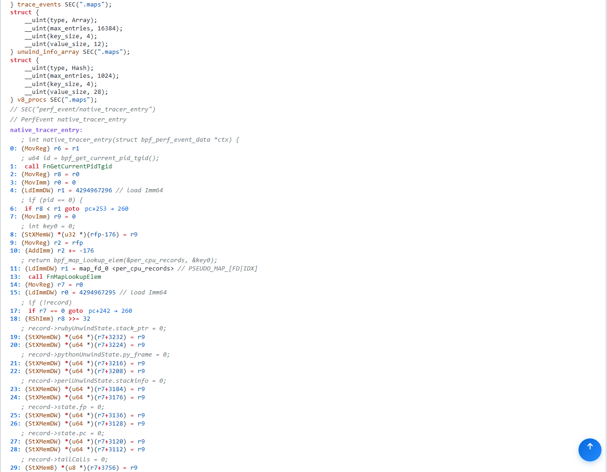
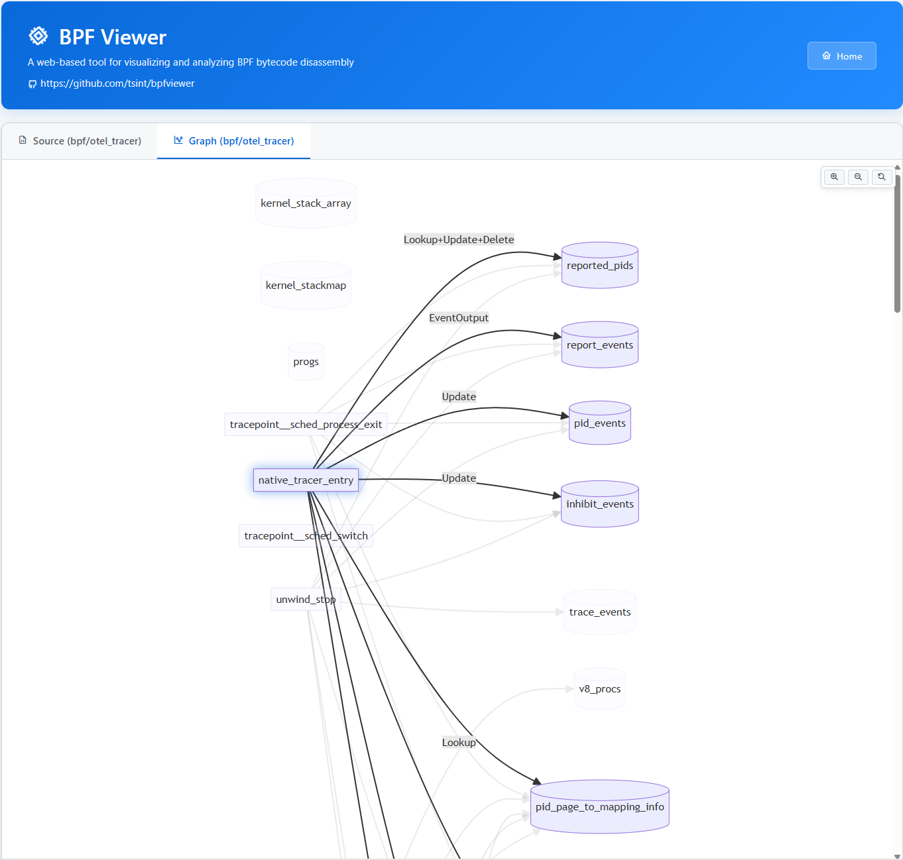

# bpfviewer - eBPF 反汇编与可视化工具

一个帮助开发者进行 eBPF 程序反汇编、分析、调试和可视化的工具。

[English](README.md)

## 背景与动机

eBPF 开发可能充满挑战，特别是在处理 BPF 程序加载错误时。虽然内核通过 `bpftool prog dump xlated` 和验证器日志提供了详细的错误信息，但将这些错误映射回原始源代码通常既困难又耗时。

现有的工具如 `llvm-objdump` 提供了基本的反汇编功能，但它们缺少：
- 程序与 Map 关系的可视化表示
- 易于阅读的指令格式化
- 程序与关联数据结构之间的快速导航
- 基于 Web 的交互式查看

**bpfviewer** 正是为了填补这一空白而创建的。它提供了编译后的 BPF 目标文件的综合视图，帮助您：
- 调试 BPF 加载失败问题
- 理解编译器输出
- 可视化程序与 Map 的交互
- 在内核验证器输出和源代码之间建立桥梁

我们希望这个工具能让 eBPF 开发更高效、更轻松。

## 功能特性

### 反汇编
- 从 ELF 目标文件完整反汇编 BPF 指令
- 人类可读的指令格式化，包含寄存器名称
- 程序元数据，包括节区、类型和指令偏移
- 支持所有标准 BPF 指令类型
- **注意**：需要使用 `-g` 选项编译 BPF 程序以保留调试信息

### 可视化
- **Mermaid 流程图**展示程序与 Map 的关系
- 自动检测 Map 操作（查找、更新、删除）
- 带语法高亮的交互式 HTML 输出
- 反汇编代码与关系图的并排视图

### 双模式运行
- **CLI 模式**：从 BPF 目标文件生成独立的 HTML 文件
- **守护进程模式**：HTTP 服务器，提供 Web 界面用于上传和查看多个文件

## 安装

```bash
go build -o bpfviewer main.go ins.go
```

## 使用方法

### CLI 模式

从 BPF 目标文件生成 HTML 文件：

```bash
./bpfviewer -f <bpf文件>
```

选项：
- `-f, --file`：要解析的 BPF 目标文件（必需）
- `-t, --temp`：HTML 模板文件（默认：`bpf_template.html`）
- `--host`：返回按钮的主页 URL
- `--version`：显示版本并退出

示例：
```bash
./bpfviewer -f tracer.o
# 输出：tracer.html
```

### 守护进程模式

作为 HTTP 服务器运行，提供 Web 界面：

```bash
./bpfviewer --daemon [--listen :8086]
```

选项：
- `--daemon`：以守护进程模式运行（HTTP 服务器）
- `--listen`：监听地址（默认：`:8086`）

服务器提供：
- 拖放式文件上传 Web 界面
- 按需自动生成 HTML
- 文件管理（列表、查看、删除）
- 预生成的 HTML 文件访问

在浏览器中打开 `http://localhost:8086` 访问 Web 界面。

## 输出示例

生成的 HTML 包含：

1. **源代码部分**：反汇编的 BPF 指令


2. **图形部分**：可视化关系图


## 项目结构

```
bpfviewer/
├── main.go           # 主程序逻辑、HTTP 处理器
├── ins.go            # BPF 指令反汇编与格式化
├── bpf_template.html # 生成的 HTML 可视化模板
├── home.html         # 守护进程模式的主页
├── bpf/              # 上传的 BPF 目标文件目录
└── html/             # 生成的 HTML 文件目录
```

## 依赖

- [cilium/ebpf](https://github.com/cilium/ebpf) - Go 语言的 eBPF 库
- [logrus](https://github.com/sirupsen/logrus) - 结构化日志库
- [pflag](https://github.com/spf13/pflag) - POSIX 兼容的命令行参数库

## 与其他工具对比

| 工具 | 反汇编 | 可视化 | Web 界面 | Prog-Map 关系 |
|------|--------|--------|----------|----------|
| **bpfviewer** | ✅ | ✅ | ✅ | ✅ |
| llvm-objdump | ✅ | ❌ | ❌ | ❌ |
| bpftool | ✅ | ❌ | ❌ | 有限 |

## 许可证

本软件采用双许可证授权。您可以选择以下任一许可证条款使用本软件：

1. Apache License, Version 2.0
   完整许可证文本见 LICENSE-Apache-2.0 文件或访问：
   https://www.apache.org/licenses/LICENSE-2.0

2. Mulan Permissive Software License, Version 2 (Mulan PSL v2)
   完整许可证文本见 LICENSE-Mulan-2.0 文件或访问：
   https://license.coscl.org.cn/MulanPSL2

除非适用法律要求或书面同意，否则根据上述任一许可证分发的软件
均按"原样"提供，不提供任何明示或暗示的担保。

